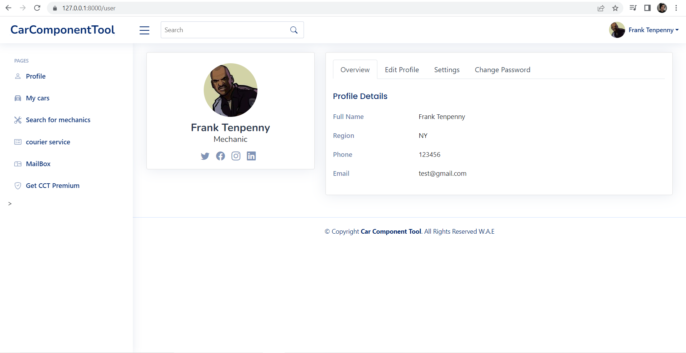
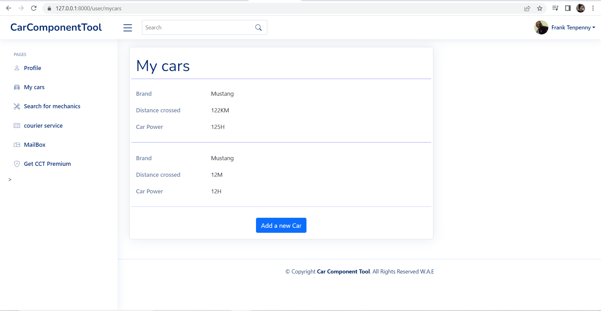
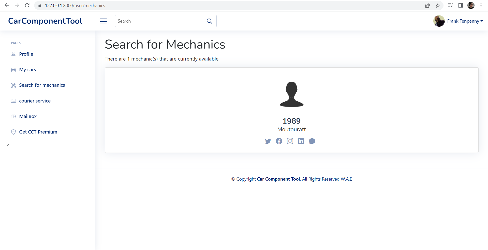
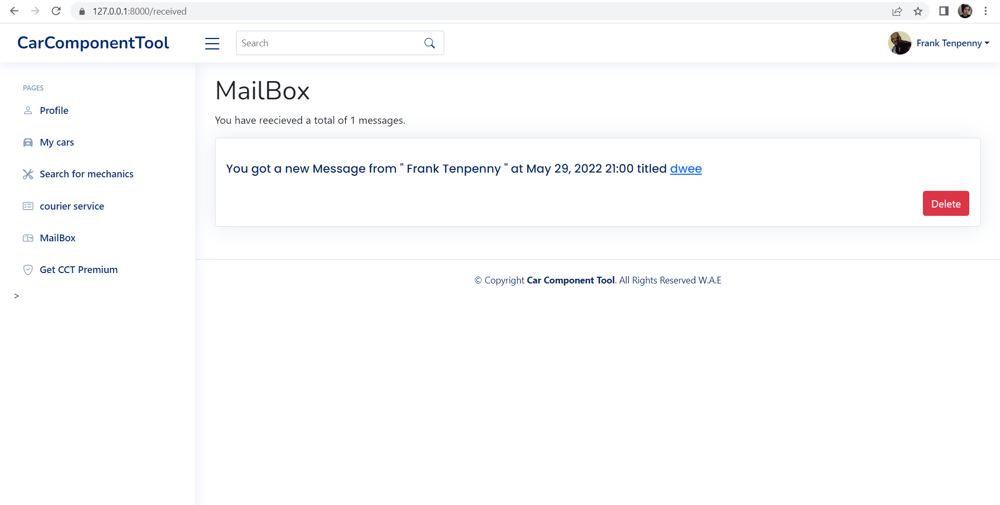

<h1 style="text-decoration: underline">CCT-Project</h1>
This is my second year study project.

It's a website developed using Symfony and MySQL for the database.

There are 2 actors who can access a specific functionality in addition to what all the users can do :

As a customer : 
  - Contact a mechanic of your choice to repair your vehicle.
  - Keep in touch with the mechanic and check the condition of your car.
  
As a mechanic : 
  - Present your expertise and experience in this field
  - Easily find customers
  
  
Every user has some functionalities they can do: 
  - Signup/Login
  - Chat
  - Add a new car

Here are some screenshots of the application.

